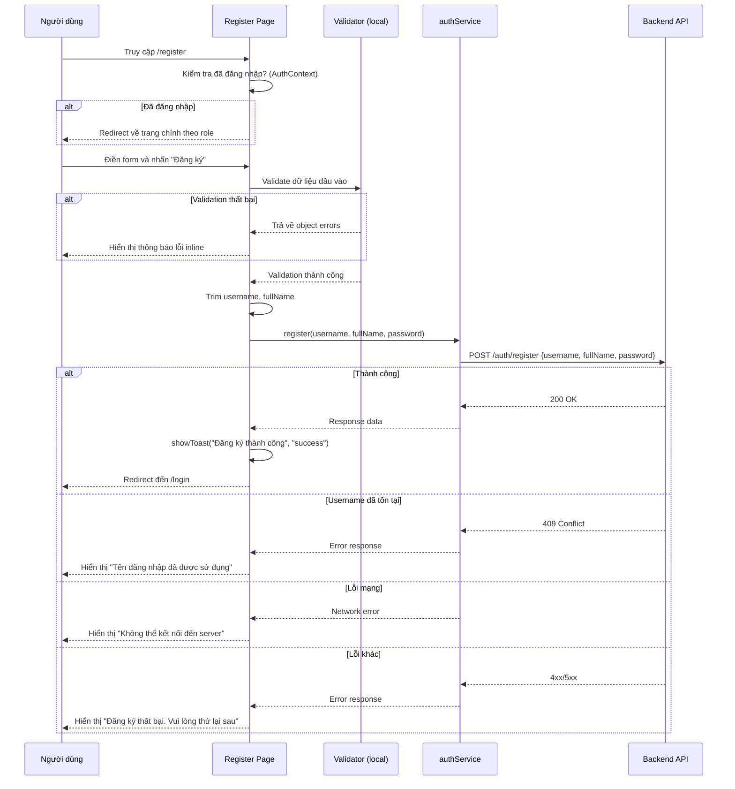

# Thiết kế Kỹ thuật — Đăng ký Người dùng

## Tổng quan

Tính năng đăng ký người dùng là một **implementation frontend-only**. Backend endpoint `POST /api/auth/register` đã tồn tại và sẵn sàng sử dụng. Phạm vi thiết kế bao gồm:

1. Thêm hàm `register` vào `authService.js`
2. Tạo trang `Register.jsx` với form đăng ký và validation
3. Thêm link điều hướng giữa trang Login và Register
4. Cập nhật routing trong `App.jsx`

Giao diện trang đăng ký sẽ nhất quán với trang Login hiện tại về style, layout và UX patterns (inline styles, CSS classes từ `index.css`, toast notifications).

## Kiến trúc (Architecture)

### Tổng quan luồng xử lý



### Các component bị ảnh hưởng

| File | Thay đổi |
|------|----------|
| `src/services/authService.js` | Thêm hàm `register` |
| `src/pages/Register.jsx` | **Tạo mới** — trang đăng ký |
| `src/pages/Login.jsx` | Thêm link "Đăng ký" |
| `src/App.jsx` | Thêm route `/register` |

## Components và Interfaces

### 1. authService — Hàm `register`

Thêm hàm `register` vào object `authService` hiện tại, tuân theo pattern giống hàm `login`:

```javascript
register: async (username, fullName, password) => {
  const response = await axios.post('/auth/register', { username, fullName, password });
  return response.data;
}
```

**Quyết định thiết kế:** Không gửi `confirmPassword` lên server (theo yêu cầu 4.4). Việc so khớp mật khẩu chỉ xử lý ở client-side.

### 2. Register Page (`src/pages/Register.jsx`)

**State management:**

```javascript
// Form state
const [username, setUsername] = useState('');
const [fullName, setFullName] = useState('');
const [password, setPassword] = useState('');
const [confirmPassword, setConfirmPassword] = useState('');

// UI state
const [errors, setErrors] = useState({});
const [serverError, setServerError] = useState('');
const [loading, setLoading] = useState(false);
```

**Quyết định thiết kế:**
- Sử dụng `errors` object (key-value) thay vì single error string để hiển thị lỗi inline cho từng trường — phù hợp với UX validation theo yêu cầu 3.
- `serverError` tách riêng khỏi `errors` vì lỗi server hiển thị ở vị trí khác (trên nút submit, không phải inline theo trường).
- Khi lỗi server xảy ra, giữ nguyên `username` và `fullName`, xóa `password` và `confirmPassword` (theo yêu cầu 5.4).

### 3. Hàm Validation (`validateForm`)

Hàm pure function nhận form data, trả về object errors:

```javascript
function validateForm({ username, fullName, password, confirmPassword }) {
  const errors = {};

  // Username: bắt buộc, chỉ chứa chữ cái, số, dấu gạch dưới
  if (!username.trim()) {
    errors.username = 'Tên đăng nhập là bắt buộc';
  } else if (!/^[a-zA-Z0-9_]+$/.test(username.trim())) {
    errors.username = 'Tên đăng nhập chỉ được chứa chữ cái, số và dấu gạch dưới';
  }

  // FullName: bắt buộc
  if (!fullName.trim()) {
    errors.fullName = 'Họ tên là bắt buộc';
  }

  // Password: bắt buộc, tối thiểu 6 ký tự
  if (!password) {
    errors.password = 'Mật khẩu là bắt buộc';
  } else if (password.length < 6) {
    errors.password = 'Mật khẩu phải có ít nhất 6 ký tự';
  }

  // ConfirmPassword: phải khớp
  if (password && confirmPassword !== password) {
    errors.confirmPassword = 'Mật khẩu xác nhận không khớp';
  }

  return errors;
}
```

**Quyết định thiết kế:**
- `validateForm` là pure function, tách riêng khỏi component để dễ test.
- Validation chạy khi submit form (không real-time) — giống pattern của Login page hiện tại.
- Username regex `^[a-zA-Z0-9_]+$` cho phép chữ cái, số và underscore, reject khoảng trắng và ký tự đặc biệt.

### 4. Xử lý lỗi server (`getServerErrorMessage`)

```javascript
function getServerErrorMessage(error) {
  if (!error.response) {
    return 'Không thể kết nối đến server. Vui lòng kiểm tra kết nối mạng';
  }
  if (error.response.status === 409) {
    return 'Tên đăng nhập đã được sử dụng';
  }
  return 'Đăng ký thất bại. Vui lòng thử lại sau';
}
```

**Quyết định thiết kế:** Giả định backend trả về HTTP 409 khi username trùng. Nếu backend dùng status code khác, có thể kiểm tra thêm `error.response.data.message` chứa keyword liên quan.

### 5. Cập nhật Login Page

Thêm link "Đăng ký" bên dưới nút đăng nhập:

```jsx
<p style={styles.registerLink}>
  Chưa có tài khoản? <Link to="/register">Đăng ký</Link>
</p>
```

### 6. Cập nhật Routing (`App.jsx`)

Thêm route `/register` tương tự route `/login`:

```jsx
<Route path="/register" element={
  <PageTransition>
    <Register />
  </PageTransition>
} />
```

### 7. Bảo vệ trang Register cho người dùng đã đăng nhập

Trong component `Register`, kiểm tra `user` từ `AuthContext`:

```javascript
const { user } = useAuth();
const navigate = useNavigate();

useEffect(() => {
  if (user) {
    navigate(user.role === 'ADMIN' ? '/admin/dashboard' : '/member/order', { replace: true });
  }
}, [user, navigate]);
```

**Quyết định thiết kế:** Xử lý redirect trực tiếp trong component Register thay vì tạo wrapper component mới — giữ đơn giản, tránh over-engineering.

## Data Models

### Request Payload — `POST /auth/register`

```json
{
  "username": "string",
  "fullName": "string",
  "password": "string"
}
```

**Lưu ý:** `confirmPassword` KHÔNG được gửi lên server. Chỉ `username`, `fullName`, `password` sau khi đã trim khoảng trắng đầu cuối cho `username` và `fullName`.

### Form State Model

| Field | Type | Mô tả |
|-------|------|--------|
| `username` | `string` | Tên đăng nhập, trim trước khi gửi |
| `fullName` | `string` | Họ tên đầy đủ, trim trước khi gửi |
| `password` | `string` | Mật khẩu, input type="password" |
| `confirmPassword` | `string` | Xác nhận mật khẩu, chỉ dùng client-side |

### Validation Errors Model

```javascript
{
  username?: string,      // Lỗi validation cho username
  fullName?: string,      // Lỗi validation cho fullName
  password?: string,      // Lỗi validation cho password
  confirmPassword?: string // Lỗi validation cho confirmPassword
}
```


## Correctness Properties

*Một property là một đặc tính hoặc hành vi phải đúng trong mọi lần thực thi hợp lệ của hệ thống — về bản chất là một phát biểu hình thức về những gì hệ thống phải làm. Properties đóng vai trò cầu nối giữa đặc tả dễ đọc cho con người và đảm bảo tính đúng đắn có thể kiểm chứng bằng máy.*

### Property 1: Trường bắt buộc trống phải bị reject

*For any* form data trong đó bất kỳ trường bắt buộc nào (username, fullName, password) là chuỗi rỗng hoặc chỉ chứa khoảng trắng, `validateForm` SHALL trả về object errors chứa thông báo lỗi tương ứng cho trường đó.

**Validates: Requirements 3.1, 3.2, 3.3**

### Property 2: Mật khẩu ngắn hơn 6 ký tự phải bị reject

*For any* chuỗi password không rỗng có độ dài từ 1 đến 5 ký tự, `validateForm` SHALL trả về lỗi "Mật khẩu phải có ít nhất 6 ký tự".

**Validates: Requirements 3.4**

### Property 3: Mật khẩu xác nhận không khớp phải bị reject

*For any* cặp (password, confirmPassword) trong đó password hợp lệ (≥ 6 ký tự) và confirmPassword ≠ password, `validateForm` SHALL trả về lỗi "Mật khẩu xác nhận không khớp".

**Validates: Requirements 3.5**

### Property 4: Username chứa ký tự không hợp lệ phải bị reject

*For any* chuỗi username không rỗng có chứa ít nhất một ký tự nằm ngoài tập `[a-zA-Z0-9_]`, `validateForm` SHALL trả về lỗi "Tên đăng nhập chỉ được chứa chữ cái, số và dấu gạch dưới".

**Validates: Requirements 3.6**

### Property 5: Form hợp lệ phải pass validation

*For any* form data trong đó username chỉ chứa `[a-zA-Z0-9_]` và không rỗng, fullName không rỗng, password có độ dài ≥ 6, và confirmPassword === password, `validateForm` SHALL trả về object errors rỗng (không có key nào).

**Validates: Requirements 3.1, 3.2, 3.3, 3.4, 3.5, 3.6**

### Property 6: Phân loại lỗi server chính xác

*For any* error object, `getServerErrorMessage` SHALL trả về: (a) thông báo lỗi mạng nếu `error.response` không tồn tại, (b) thông báo username trùng nếu status === 409, (c) thông báo lỗi mặc định cho mọi status code khác.

**Validates: Requirements 5.1, 5.2, 5.3**

### Property 7: Trim khoảng trắng đầu cuối trước khi gửi

*For any* chuỗi username và fullName có chứa khoảng trắng đầu hoặc cuối, giá trị được gửi trong payload đến server SHALL bằng giá trị sau khi trim — tức là `payload.username === input.username.trim()` và `payload.fullName === input.fullName.trim()`.

**Validates: Requirements 6.3**

## Xử lý Lỗi (Error Handling)

### Lỗi Validation (Client-side)

| Trường hợp | Xử lý | Hiển thị |
|-------------|--------|----------|
| Trường bắt buộc trống | Ngăn submit, hiển thị lỗi inline | Text đỏ dưới trường tương ứng |
| Username chứa ký tự không hợp lệ | Ngăn submit, hiển thị lỗi inline | Text đỏ dưới trường username |
| Password < 6 ký tự | Ngăn submit, hiển thị lỗi inline | Text đỏ dưới trường password |
| ConfirmPassword không khớp | Ngăn submit, hiển thị lỗi inline | Text đỏ dưới trường confirmPassword |

### Lỗi Server (API response)

| HTTP Status | Ý nghĩa | Thông báo hiển thị |
|-------------|----------|---------------------|
| 409 Conflict | Username đã tồn tại | "Tên đăng nhập đã được sử dụng" |
| 4xx/5xx khác | Lỗi server không xác định | "Đăng ký thất bại. Vui lòng thử lại sau" |
| Network Error | Không có response (mất kết nối) | "Không thể kết nối đến server. Vui lòng kiểm tra kết nối mạng" |

### Hành vi sau lỗi server

- Giữ nguyên giá trị `username` và `fullName` trong form
- Xóa trắng `password` và `confirmPassword`
- Bật lại nút "Đăng ký" (tắt loading state)
- Hiển thị thông báo lỗi phía trên nút submit

## Chiến lược Testing

### Tổng quan

Dự án hiện tại **chưa có test framework** (package.json không có vitest, jest, hay testing-library). Để implement property-based testing, cần cài đặt:

- **vitest** — test runner tương thích Vite
- **@testing-library/react** + **@testing-library/jest-dom** — component testing
- **fast-check** — thư viện property-based testing cho JavaScript

### Unit Tests (Example-based)

| Test | Mô tả | Validates |
|------|--------|-----------|
| Render form fields | Form có đủ 4 trường input | Req 2.1 |
| Required attributes | Các trường có thuộc tính required | Req 2.2 |
| Password input type | Input password và confirmPassword có type="password" | Req 6.1 |
| Login link trên Register | Trang Register có link "Đăng nhập" | Req 1.3 |
| Register link trên Login | Trang Login có link "Đăng ký" | Req 1.1 |
| Loading state | Nút disabled và hiển thị loading khi đang submit | Req 4.2 |
| Success flow | Toast thành công + redirect đến /login | Req 4.3 |
| Payload không chứa confirmPassword | authService.register chỉ gửi username, fullName, password | Req 4.4 |
| Error 409 hiển thị đúng message | Hiển thị "Tên đăng nhập đã được sử dụng" | Req 5.1 |
| Network error hiển thị đúng message | Hiển thị thông báo lỗi mạng | Req 5.3 |
| Giữ form data sau lỗi | username/fullName giữ nguyên, password/confirmPassword bị xóa | Req 5.4 |
| Redirect khi đã đăng nhập | Redirect ADMIN về /admin/dashboard, MEMBER về /member/order | Req 7.1 |

### Property-Based Tests

Sử dụng **fast-check** với tối thiểu 100 iterations mỗi property:

| Property | Mô tả | Tag |
|----------|--------|-----|
| Property 1 | Trường bắt buộc trống bị reject | Feature: user-registration, Property 1: Required field empty rejection |
| Property 2 | Password ngắn bị reject | Feature: user-registration, Property 2: Short password rejection |
| Property 3 | ConfirmPassword không khớp bị reject | Feature: user-registration, Property 3: Password mismatch rejection |
| Property 4 | Username ký tự không hợp lệ bị reject | Feature: user-registration, Property 4: Invalid username chars rejection |
| Property 5 | Form hợp lệ pass validation | Feature: user-registration, Property 5: Valid form passes validation |
| Property 6 | Phân loại lỗi server chính xác | Feature: user-registration, Property 6: Server error classification |
| Property 7 | Trim whitespace trước khi gửi | Feature: user-registration, Property 7: Whitespace trimming |

### Cấu hình Test

```javascript
// vitest.config.js hoặc trong vite.config.js
test: {
  environment: 'jsdom',
  globals: true,
}
```

Mỗi property test chạy tối thiểu **100 iterations** (cấu hình mặc định của fast-check). Mỗi test có comment tag theo format: `Feature: user-registration, Property {number}: {property_text}`.
